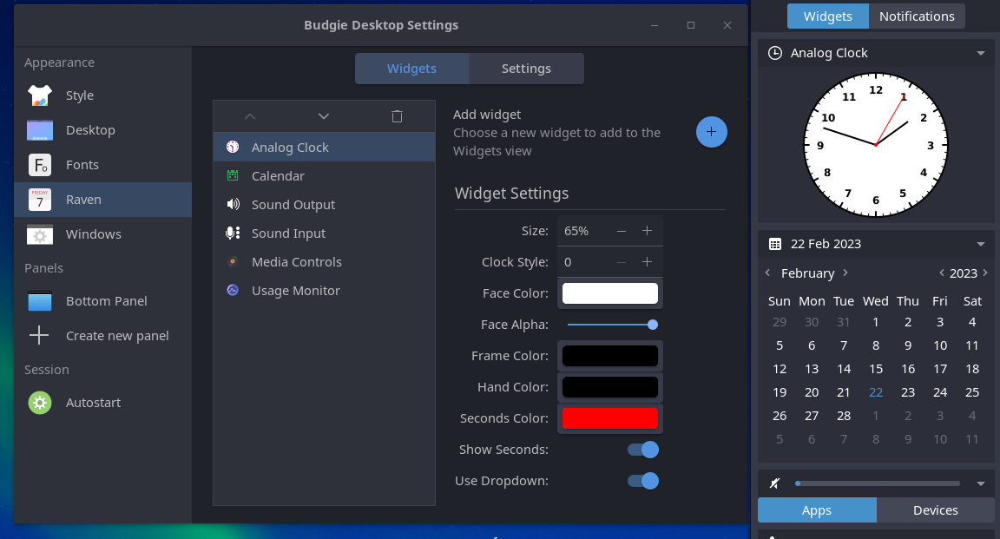

# Budgie Analog Clock Widget

### W.I.P.

An analog syle clock for the Budgie Desktop Raven panel
This widget will evenually be a part of the Analogue Clock Applet.

However, though it is a work in progress, it is 100% fully funtcional in its current form.

Dependencies

* gtk+-3.0
* budgie-raven-plugin-1.0
* libpeas-gtk-1.0

To install (for Debian/Ubuntu):

    mkdir build
    cd build
    meson setup --prefix=/usr --libdir=/usr/lib
    ninja
    sudo ninja install
